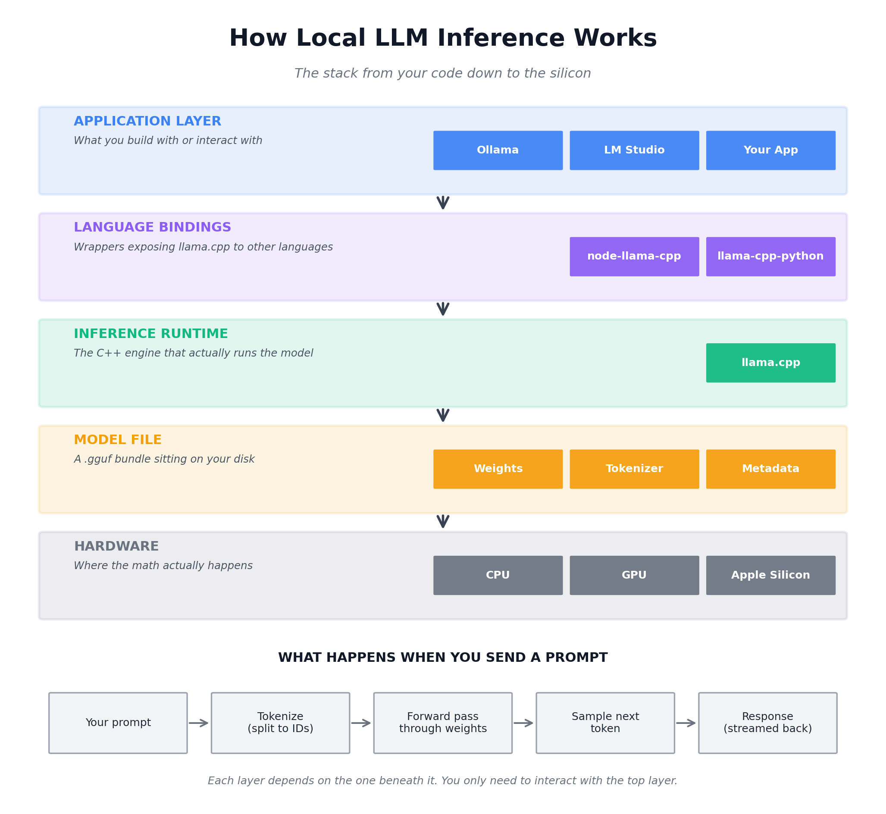

# Running LLMs Locally with llama.cpp and GGUF

### Overview
Running large language models on personal hardware has become practical through an ecosystem built around three concepts: the model file, the inference runtime, and a portable distribution format. Together they let developers run capable LLMs on laptops and desktops without relying on cloud APIs.

### What a model is
A model is a file (or small set of files) containing the weights — billions of numerical parameters learned during training. The file itself is inert; it becomes useful only when loaded by an inference runtime that understands the model's architecture and can pass input through the network to generate output. Model size typically ranges from 1 GB to 40+ GB, and capability scales roughly with parameter count (e.g., 3B, 8B, 70B).

### The runtime: llama.cpp
`llama.cpp` is the dominant open-source inference engine for local LLMs. Written in C++ with minimal dependencies, it runs efficiently on CPUs, NVIDIA and AMD GPUs, and Apple Silicon. Originally built for Meta's LLaMA models, it now supports many architectures including Mistral, Qwen, Gemma, Phi, and DeepSeek. Language bindings such as `node-llama-cpp` (JavaScript) and `llama-cpp-python` (Python) expose the engine to application code, while tools like Ollama and LM Studio wrap it in friendlier interfaces.

### The format: GGUF
GGUF (GGML Universal File format) is the standard file format used by llama.cpp. A single `.gguf` file bundles model weights, tokenizer, and metadata such as architecture type and chat template, simplifying distribution. GGUF also enables quantization — compressing weights from 16-bit floats down to 8, 5, 4, or 2 bits. This shrinks an 8B model from ~16 GB to ~4 GB at 4-bit precision with modest quality loss. The `Q4_K_M` scheme is a widely used balance of size and quality. GGUF files are commonly hosted on Hugging Face.

### How to run models locally
Entry points range in difficulty: Ollama offers one-command setup; LM Studio provides a desktop GUI; `node-llama-cpp` and similar bindings suit application development; raw llama.cpp binaries offer maximum control. A typical workflow is to download a quantized `.gguf` file, point the chosen tool at it, and begin sending prompts.

### Benefits
Local inference offers data privacy (prompts never leave the machine), zero marginal cost per token, offline availability, freedom from rate limits, and full control over the model, sampling parameters, and fine-tuning. It is also a strong learning vehicle for understanding how LLMs actually work under the hood.

### Tradeoffs
Models small enough to run on consumer hardware are meaningfully less capable than frontier hosted models such as Claude or GPT-class systems, particularly on complex reasoning and long-context tasks. Reasonable performance requires at least 8 GB of RAM (16+ GB recommended) and benefits substantially from a GPU or Apple Silicon. Users must also manage model selection, quantization tradeoffs, and prompt formatting themselves.

### Conclusion
The combination of llama.cpp as the runtime and GGUF as the format has made local LLM inference accessible to a broad audience, suitable for privacy-sensitive applications, cost-controlled deployments, and experimentation, with the understanding that capability tradeoffs remain relative to hosted frontier systems.

### Diagram
