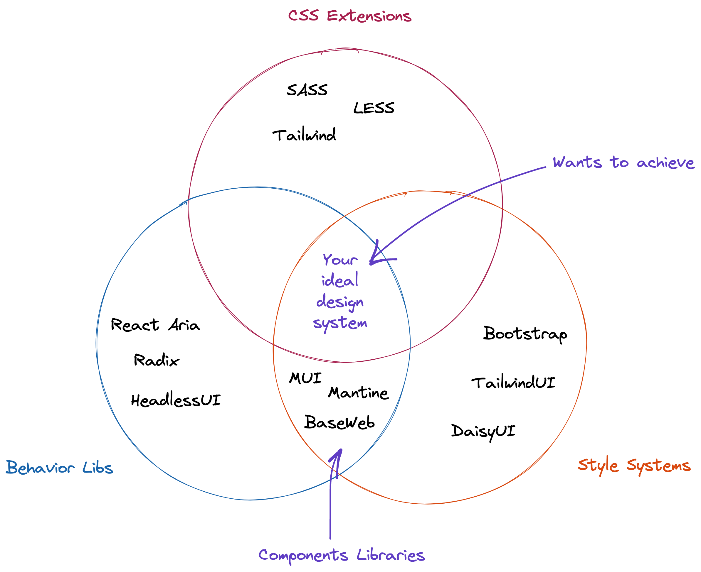

# UI Libraries

Types of UI libraries, styling approaches and how to choose the right one.

## Types of UI Tools

- CSS++ - Extensions of CSS (SASS, LESS, Tailwind);
- Behavior Libraries - **unstyled** low-level UI primitives that provides bahavior focusing on accessibility and customization. (HeadlessUI, Radix, React Aria);
- Style Systems - set of ready-to-use styles (TailwindUI, DaisyUI);

## Interconnections

## Components libraries

Pros:

- Fast adoption/fast prototyping (controversial);
- Pretty good UI out of the box (controversial);

Cons:

- Need to learn a library (not a browser technology like CSS and HTML but specific library and follow its rules);
- Limitations on extension (can't easily change (and in some cases its even imposible) behavior of component);
- Your UI will look like X component library (everybody wants a unique clean design but in such case we stick to feel and look of X library);

## Sources

- [UI Libraries: Picking The Best](https://www.youtube.com/watch?v=CQuTF-bkOgc)
